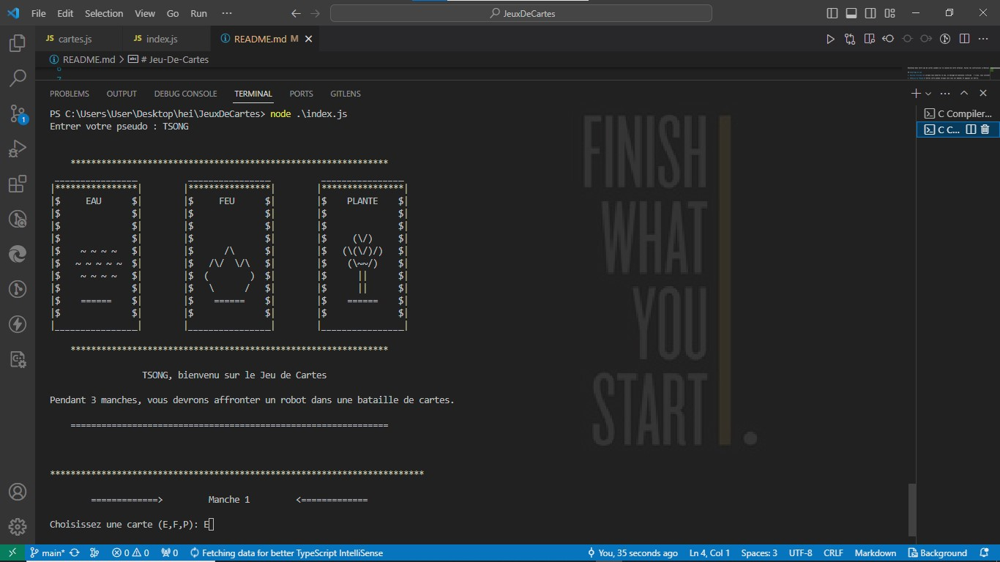
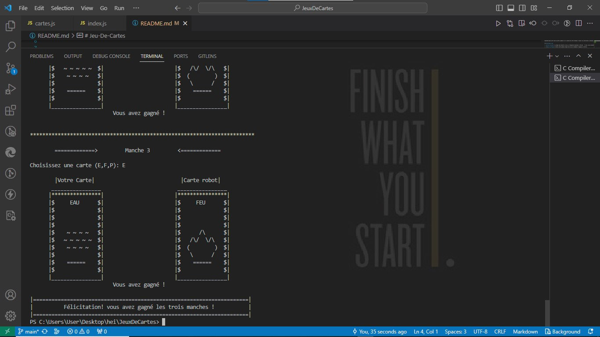

# Jeu-De-Cartes

Bienvenue dans notre jeu de cartes jouable sur la console de votre terminal. Suivez les instructions ci-dessous pour profiter de l'expérience de jeu.

## Démarrage du Jeu

1. **Écran d'accueil:** Lorsque vous démarrez le jeu, un message de bienvenue s'affiche à l'écran, vous invitant à saisir votre pseudo.

2. **Saisie du Pseudo:** Entrez votre pseudo lorsque cela vous est demandé et appuyez sur Entrée.

## Déroulement du Jeu

Le jeu se compose de 3 manches, où vous affronterez un robot dans une bataille de cartes.

1. **Sélection de Cartes:** Vous et le robot aurez chacun 3 cartes de types différents (Eau, Feu, Plante) pour une manche.

2. **Choix de Cartes:** Choisissez une carte parmi celles que vous avez en votre possession. Le robot fera de même.

3. **Révélation des Cartes:** Vous montrez votre carte choisie au robot, qui révèle une de ses cartes au hasard.

4. **Résultats de la Manche:** Chaque manche produira l'un des résultats suivants :
   - Victoire (si votre carte bat celle du robot)
   - Égalité (si les cartes sont du même type)

5. **Réutilisation des Cartes:** Vous et le robot ne pourrez utiliser qu'une seule carte par manche, mais vous pouvez réutiliser la même carte pour les manches suivantes.

6. **Fin des 3 Manches:** À la fin de la troisième manche, le résultat final sera affiché pour déterminer le gagnant.

## Types de Cartes

Il existe trois types de cartes, chacune ayant un avantage sur un autre :
- Eau bat le Feu
- Feu bat la Plante
- Plante bat l'Eau

## Résultat Final

Le résultat final ne peut être que :
- Victoire (si vous remportez plus de manches que le robot)
- Égalité (si le score est à égalité)

## Nouvelle Partie

Si le résultat final est une égalité, vous aurez la possibilité de retenter votre chance contre le robot. Si vous ne souhaitez pas continuer, le jeu se termine.

## Comment jouer
1. Clonez le dépôt : `git clone https://github.com/Tsilavina007/Jeu-De-Cartes`
2. Exécutez le jeu : `node index.js`

## Configuration requise
- Node.js (version 16.18.0)

## Auteurs
- [Tsilavina](https://github.com/Tsilavina007)
- [Ranto](https://github.com/Ranto-creat)

Amusez-vous bien et que le meilleur gagne ! 🃏🤖
